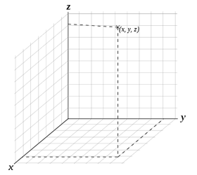

Introduction
============

Syllabus
--------

### Highlights

-   **Professor**: Max Lieblich, lieblich@uw.edu
-   **Course website**: [enjoy](../Math126/index.php). (Just search for
    "Max Lieblich math 126" on the internet to find it.)
-   **Homework**: [webassign](http://www.webassign.net), due every
    Tuesday and Thursday
-   **Midterms**: two.
-   **Final**: end of quarter, three hours of fun.
-   **Grading**: roughly 33% for each midterm and the final. I reserve
    the right to tweak this at any time.
-   What can we expect from one another?

Math Study Center
-----------------

-   Open to anyone, with questions or without, confused or clear, loving
    math or not.
-   Communications B-014
-   Hours:
    -   M-Th: 9:30AM to 9:30PM
    -   Fri: 9:30AM to 1:30PM
    -   Sun: 2PM to 6PM
-   You will need to make your own private Math Study Center on
    Saturday.

Questions?
----------

-   Am I ready for this course?
-   What will the median grade be?
-   How will I ever stop loving calculus?

You have seen
-------------

-   Derivatives...
-   Integrals...
-   Differential equations...
-   In one variable only
-   (with a smidgen of parametric motion).

### We have really only equipped you to understand life on a string.

That sucks
----------

### How can we understand a situation closer to reality?

#### How can we

-   model three-dimensional space?
-   describe shapes in that space?
-   describe physical properties of objects in space (center of mass,
    density, etc.)?

Questions we might ask:
=======================

Question
--------

How does it feel to fly along this trefoil path?

  </img>

Question
--------

How do we find lines perpendicular to a surface (even a weird one)?

  </img>

Question
--------

What makes this shape...

  </img>

Question
--------

...different from this one?

  </img>

Properties we might examine
---------------------------

### We could try to characterize shapes and objects using things like

-   Curvature (what is this?)
-   Surface area (I think I know what this is)
-   Volume (OK, whatever)
-   What other mathematical properties might distinguish objects?

Space
=====

What is reality?
----------------

### Three dimensional space

-   What is it?
-   Here's a picture:
-   No, really, that's a picture. Is it missing something?

What is reality?
----------------

### How can we describe this space so that we can calculate things? Get a handle on it? Use it for something? {.question}

-   Predict future positions or motions
-   Quantify mass, volume, stress
-   Tell the supplier how much cheese we need for the giant wheel

René Descartes
--------------

-   Je pense, donc je suis.
-   "I think, therefore I am."

### Descartes thought of something brilliant, something that shook the world. {.slide}

-   Does anyone know what I am talking about?
-   (The pineal gland??)

René Descartes
--------------

### Descartes discovered *coordinates*

-   The 3D space of human experience is the set of ordered triples of
    numbers:
-   $$\mathbf{R^3}=\{(x,y,z) | x,y,z\in\mathbf{R}\}$$
-   Here's a picture you probably recognize.

Numbers breed numbers
---------------------

### We can now calculate distance!

Distance between two points $(a,b,c)$ and $(a',b',c')$ is

$$\sqrt{(a'-a)^2+(b'-b)^2+(c'-c)^2}.$$

This generalizes the Pythagorean theorem. The book has a good
explanation of why it's true. See if you can figure it out (using the
Pythagorean theorem) before you read it! If you have already read it,
try before reading it again. (You read each section of the book several
times, right?)

Numbers breed equations
-----------------------

### We can now describe shapes!

-   What is the set of points at distance 1 from $(0,0,0)$?
-   What shape is the set of points $(x,y,z)$ such that $x+y=z$?
-   ...such that $x^2+y^2=z^2$?
-   ...such that $x^2+y^2=z$? (How does it differ from the previous
    one?)
-   ...such that $y=x^2$?
-   ...such that $z=4$?
