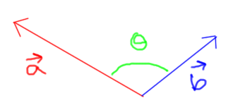
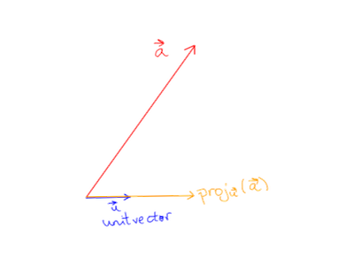

Dot products
============

Warm up
-------

Let's start with a few natural questions about vectors that arise in the
world.

Warm up
-------

Question: a light shines perpendicularly down onto the plane
$x-y+z=0$. Can we calculate the shadow of the vector $\langle
3,4,5\rangle$ in the plane? (Natural question for computer graphics,
architecture, etc. )

  </img>

Warm up
-------

**Similar:** a light shines perpendicularly down onto the plane $z=0$.
How can we calculate the shadow of the vector $\langle 3,4,5\rangle$
in the plane?

Warm up
-------

**Similar:** a light shines perpendicularly down onto the plane $z=0$.
How can we calculate the shadow of the vector $\langle 3,4,5\rangle$
in the plane?

Can you draw a picture of this one?

Warm up
-------

**Similar:** a light shines perpendicularly down onto the plane $z=0$.
How can we calculate the shadow of the vector $\langle 3,4,5\rangle$
in the plane?

Can you draw a picture of this one?

**Answer:**

Warm up
-------

**Similar:** a light shines perpendicularly down onto the plane $z=0$.
How can we calculate the shadow of the vector $\langle 3,4,5\rangle$
in the plane?

Can you draw a picture of this one?

**Answer:** projecting into the $xy$-plane just forgets about the
$z$-component!

Warm up
-------

**Question:** given two vectors in $\mathbf{R}^3$, how can we compute
the angle between them?

Today
-----

We'll learn about a marvelous tool for answering these questions called
the dot product.

As with components and addition of vectors, coordinates allow us to
calculate the geometry.

As simple as they seem, the ideas we'll discuss here tap into one of the
richest veins of ideas in mathematics.

Definition
----------

The dot product of two vectors

$$\mathbf{a}=\langle a_1,a_2,a_3\rangle\textrm{ }\mathbf{b}=\langle b_1,b_2,b_3\rangle$$

is the number

$$\mathbf{a}\cdot\mathbf{b}=a_1b_1+a_2b_2+a_3b_3.$$

Definition
----------

The dot product of two vectors

$$\mathbf{a}=\langle a_1,a_2,a_3\rangle\textrm{ }\mathbf{b}=\langle b_1,b_2,b_3\rangle$$

is the number

$$\mathbf{a}\cdot\mathbf{b}=a_1b_1+a_2b_2+a_3b_3.$$

Note: this is a number (scalar), not a vector!

### Examples

-   $\langle 1, 2, 3\rangle\cdot\langle 3, 0, 1\rangle = 1\cdot
    3+2\cdot 0+3\cdot 1=6$
-   $\langle 2, 5\rangle\cdot\langle 5, -2\rangle = 2\cdot 5 +
    5\cdot(-2) = 0$

Practice
--------

Compute these dot products (build a data set for your inner child!):

-   $\langle 1,0,0\rangle\cdot\langle 2,3,7\rangle$
-   $\mathbf{i}\cdot\mathbf{j}$ (you know what $\mathbf{i}$ and
    $\mathbf{j}$ are because you read the book!)
-   $\mathbf{i}\cdot\mathbf{i}$
-   take a point $(x,y,z)$ in the plane $x+y+z=0$ and compute
    $\langle x,y,z\rangle\cdot\langle 1,1,1\rangle$

Observations
------------

-   $\mathbf{i}$ and $\mathbf{j}$ are perpendicular, and $\mathbf{i}\cdot\mathbf{j}=0$
-   $\mathbf{i}$ has length $1$, and $\mathbf{i}\cdot\mathbf{i}=1$
-   Coincidence?

Sweet Theorem
-------------

Given two vectors $\mathbf{a}$ and $\mathbf{b}$, the angle
$\theta$ between them satisfies

$$\mathbf{a}\cdot\mathbf{b}=|\mathbf{a}||\mathbf{b}|\cos(\theta).$$

Sweet Theorem
-------------

Given two vectors $\mathbf{a}$ and $\mathbf{b}$, the angle
$\theta$ between them satisfies

$$\mathbf{a}\cdot\mathbf{b}=|\mathbf{a}||\mathbf{b}|\cos(\theta).$$

Since by convention we always take the angle between two vectors to lie
between $0$ and $\pi$ radians, this determines $\theta$
uniquely.

This theorem shows how the dot product relates to both angle and length

Let's see how we can leverage this for both angles and lengths.

Angles
======

Angles: example
---------------

The angle $\theta$ between $\langle 1,3,5\rangle$ and $\langle
-1,3,2\rangle$ satisfies

$$18=\sqrt{35}\sqrt{14}\cos(\theta).$$

Conclusion: $\theta=0.6212404....$ radians, or around $35.59$
degrees.

No picture necessary!

Angles: one to try
------------------

What is the angle between $\langle 1,0,0\rangle$ and $\langle
2,2,0\rangle$?

Angles: orthogonality
---------------------

Two vectors $\mathbf{a}$ and $\mathbf{b}$ are perpendicular if and
only if $\mathbf{a}\cdot\mathbf{b}=0$.

Geometry encoded with numbers.

Length
======

Length: True or False? {.question}
----------------------

For any vector $\mathbf{a}$, we have that $\mathbf{a}\cdot\mathbf{a}$ equals the length of $\mathbf{a}$.

Length: components
------------------

Suppose $\mathbf{u}$ is a unit vector (i.e., a vector of length
$1$). Then for any vector $\mathbf{a}$, the new vector

$$\operatorname{proj}_{\mathbf{u}}(\mathbf{a})=(\mathbf{a}\cdot\mathbf{u})\mathbf{u}$$

gives the projection of $\mathbf{a}$ onto $\mathbf{u}$.

The number $\mathbf{a}\cdot\mathbf{u}$ is called the component of
$\mathbf{a}$ in the direction of $\mathbf{u}$.

Example
-------

Practice {style="margin-bottom: 20px"}
--------

-   Let $\mathbf{u}$ be a unit vector in the same direction as
    $\langle 1,1,1\rangle$. Find $\mathbf{u}$ and compute the
    projection $$\mathbf{c}=\operatorname{proj}_{\mathbf{u}}(\langle 3,4,5\rangle).$$
-   Does the difference vector $$\langle 3,4,5\rangle-\mathbf{c}$$
    have endpoint in the plane $x+y+z=0$?

Dot products: wrap up
=====================

More problems
-------------

-   Find a unit vector perpendicular to both $\mathbf{i}+\mathbf{j}$
    and $\mathbf{i}+\mathbf{k}$.
-   Calculate the angles in the triangle connecting the points
    $(0,0,0)$, $(0,1,3)$, $(2,1,-1)$ to three significant digits.

Original question
-----------------

How do we calculate the projection of a vector into a plane?

What is the projection in human terms? "Walk along the plane from the
origin of the vector until you are just underneath its tip."

So: if you look straight "up" (perpendicular to the plane) from the
endpoint of the projection, you see the endpoint of the original vector.

How do we express "first go here, then go there" using vectors?

What if you project onto the line perpendicular to the plane and
subtract that projection from the original vector?
